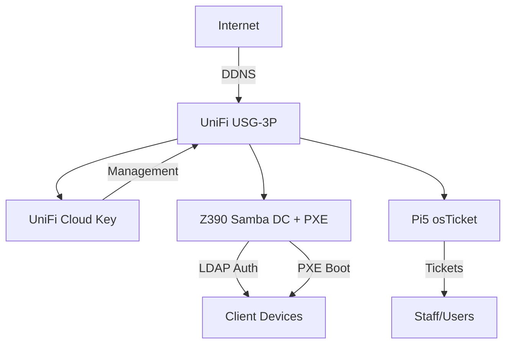

# Welcome to Legacy EdTech Backbone

## Project Overview

**Legacy EdTech Backbone** is a zero-touch IT stack for edtech-print bundles: Samba AD Domain Controller + PXE imaging on repurposed hardware. Built for operational reality—stable auth for print services, automated lab deployments, and resilient infrastructure without vendor lock-in.

## Why This Stack?

- **Cost-Effective**: Z390 workstations and Raspberry Pi devices instead of expensive servers (<$1,000 total)
- **Zero-Touch Deployment**: Image 50+ devices in an afternoon with PXE network boot
- **Production-Tested**: Real-world configurations for edtech environments
- **Modular & Documented**: MkDocs site with tested commands and troubleshooting guides

## Quick Links

-   :material-server:{ .lg .middle } __Hardware Setup__

    ---

    Start here to understand the hardware requirements and prepare your gear.

    [:octicons-arrow-right-24: Hardware Specs](01-hardware-specs.md)

-   :material-ubuntu:{ .lg .middle } __OS Installation__

    ---

    Install Ubuntu 24.04 LTS with RAID1 for the domain controller.

    [:octicons-arrow-right-24: OS Setup](02-os-install.md)

-   :material-security:{ .lg .middle } __Samba AD DC__

    ---

    Provision Active Directory domain controller with Samba.

    [:octicons-arrow-right-24: Domain Setup](03-samba-provision.md)

-   :material-network:{ .lg .middle } __Network Infrastructure__

    ---

    Configure UniFi Cloud Key, USG, switches, and access points.

    [:octicons-arrow-right-24: UniFi Guide](06-unifi-setup.md)

## Architecture at a Glance

## Three-Pillar Architecture

### Pillar 1: Foundation (Network & Auth Core) - ~80% Complete
Stable authentication and network infrastructure:

- **Samba AD DC** on Z390 (RFC2307 POSIX, RAID1-backed)
- **UniFi network** with DDNS (Cloud Key, USG-3P, switches, APs)
- **osTicket on Pi5** for lightweight helpdesk
- **Goal**: <50ms auth latency, tested client joins

### Pillar 2: Automation (Imaging Workflows) - In Progress
Zero-touch deployment system:

- **PXE proxy** on Z390 (dnsmasq/iPXE)
- **Golden images** (Win11 EDU, Ubuntu preseed)
- **USG DHCP options** (66/67 for chainload)
- **Auto-domain join** scripts
- **Goal**: 30-min deploys, 80% auto-success rate

### Pillar 3: Resilience & Scale - Planned
Operational hardening and scale prep:

- **Automated backups** (cron'd, offline Samba dumps)
- **Security hardening** (UFW, fail2ban, health scripts)
- **Future**: Multi-DC (Pi5 secondary), IaC (Ansible port)
- **Goal**: SPOF alerts, easy disaster recovery

## Getting Started

Recommended path through the documentation:

1. **[Hardware Specs](01-hardware-specs.md)** - Verify Z390 BIOS, CPU baseline (lscpu)
2. **[OS Installation](02-os-install.md)** - Ubuntu 24.04 + RAID1 setup
3. **[Samba AD DC](03-samba-provision.md)** - Domain provision with `./scripts/provision-dc.sh`
4. **[Security Hardening](05-security-monitoring.md)** - UFW rules, fail2ban
5. **[PXE Setup](08-pxe-setup.md)** - Network boot server for imaging

## Community & Support

- **GitHub Issues**: [Report bugs or request features](https://github.com/T-Rylander/legacy-edtech-backbone/issues)
- **Contributing**: See [CONTRIBUTING.md](https://github.com/T-Rylander/legacy-edtech-backbone/blob/main/CONTRIBUTING.md)
- **Troubleshooting**: [Common issues guide](10-troubleshooting.md)

## License

This project is licensed under the MIT License. See the [LICENSE](https://github.com/T-Rylander/legacy-edtech-backbone/blob/main/LICENSE) file for details.

---

**Current Status**: Pillar 1 (Foundation) ~80% complete | PXE scripting in progress  
**Ready to build?** Start with [Hardware Specs →](01-hardware-specs.md)
