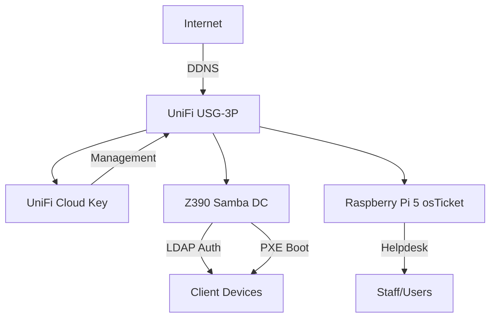

# Welcome to Legacy EdTech Backbone

## Project Overview

Welcome to the **Legacy EdTech Backbone** documentation. This project demonstrates how small MSPs and school IT departments can build enterprise-grade edtech services using repurposed hardware and lean automation.

## Why This Project?

- **Cost-Effective**: Repurpose Z390 workstations and Raspberry Pi devices instead of expensive servers
- **Zero-Touch Deployment**: Image 50+ devices in an afternoon with PXE network boot
- **Production-Ready**: Real-world configurations tested in edtech environments
- **Open Source**: MIT licensed, fork-friendly, and documented for learning

## Quick Links

-   :material-server:{ .lg .middle } __Hardware Setup__

    ---

    Start here to understand the hardware requirements and prepare your gear.

    [:octicons-arrow-right-24: Hardware Specs](01-hardware-specs.md)

-   :material-ubuntu:{ .lg .middle } __OS Installation__

    ---

    Install Ubuntu 24.04 LTS with RAID1 for the domain controller.

    [:octicons-arrow-right-24: OS Setup](02-os-install.md)

-   :material-security:{ .lg .middle } __Samba AD DC__

    ---

    Provision Active Directory domain controller with Samba.

    [:octicons-arrow-right-24: Domain Setup](03-samba-provision.md)

-   :material-network:{ .lg .middle } __Network Infrastructure__

    ---

    Configure UniFi Cloud Key, USG, switches, and access points.

    [:octicons-arrow-right-24: UniFi Guide](06-unifi-setup.md)

## Architecture at a Glance

## Three-Phase Approach

### Phase 1: Foundation (Weeks 1-2)
Build stable network and authentication infrastructure:

- Samba AD Domain Controller on Z390
- UniFi network with DDNS
- Basic security hardening (UFW, fail2ban)
- **Goal**: 50-user auth latency <50ms

### Phase 2: Automation (Weeks 3-4)
Implement zero-touch deployment workflows:

- PXE network boot server
- Golden Windows 11 EDU and Ubuntu images
- Auto-domain join scripts
- **Goal**: <30 min deploy time per device

### Phase 3: Scale (Weeks 5+)
Add monitoring and operational tools:

- osTicket helpdesk on Pi 5
- Prometheus + Grafana dashboards
- Automated backup procedures
- **Goal**: 20% service upsell rate

## Getting Started

Ready to dive in? Here's the recommended path:

1. **Review** [Hardware Specs](01-hardware-specs.md) to verify your equipment
2. **Follow** [OS Installation](02-os-install.md) to prepare the Z390
3. **Provision** [Samba AD DC](03-samba-provision.md) for domain services
4. **Configure** [Security & Monitoring](05-security-monitoring.md) for hardening
5. **Deploy** [PXE Setup](08-pxe-setup.md) for mass imaging

## Community & Support

- **GitHub Issues**: [Report bugs or request features](https://github.com/T-Rylander/legacy-edtech-backbone/issues)
- **Twitter/X**: Follow [@MTRad_vis](https://twitter.com/MTRad_vis) for updates
- **Contributing**: See [README.md](https://github.com/T-Rylander/legacy-edtech-backbone) for guidelines

## License

This project is licensed under the MIT License. See the [LICENSE](https://github.com/T-Rylander/legacy-edtech-backbone/blob/main/LICENSE) file for details.

---

**Ready to build?** Start with [Hardware Specs →](01-hardware-specs.md)
